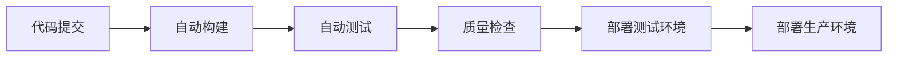

# DevOps 核心概念学习笔记

## 学习日期

2025-06-26

## 核心概念

### 什么是 DevOps

DevOps = Development + Operations

- 文化理念：打破开发和运维的壁垒
- 实践方法：自动化、持续集成、持续交付
- 工具链：覆盖从开发到部署的全流程

### CI/CD 流程

```mermaid
graph LR
    A[代码提交] --> B[自动构建]
    B --> C[自动测试]
    C --> D[质量检查]
    D --> E[部署测试环境]
    E --> F[部署生产环境]
```
